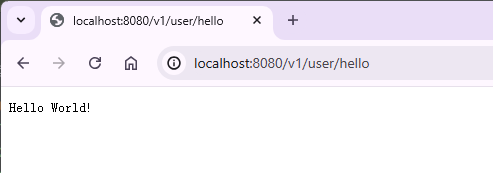
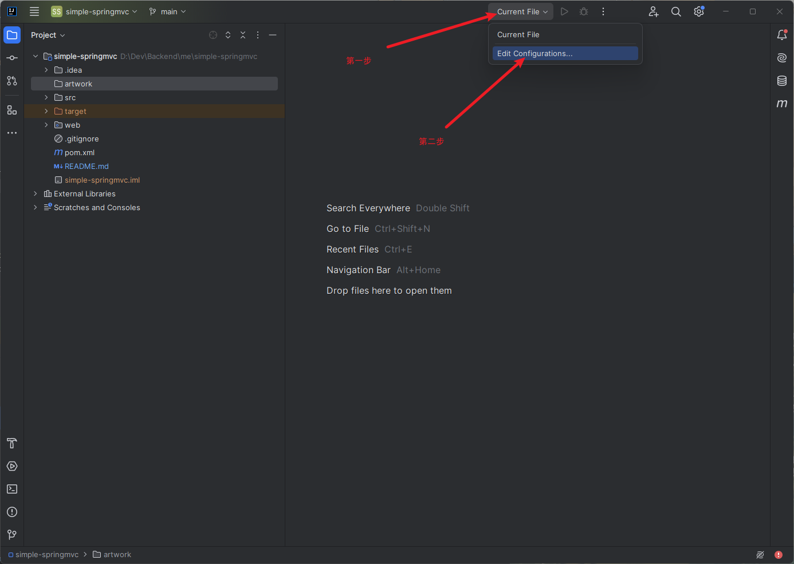
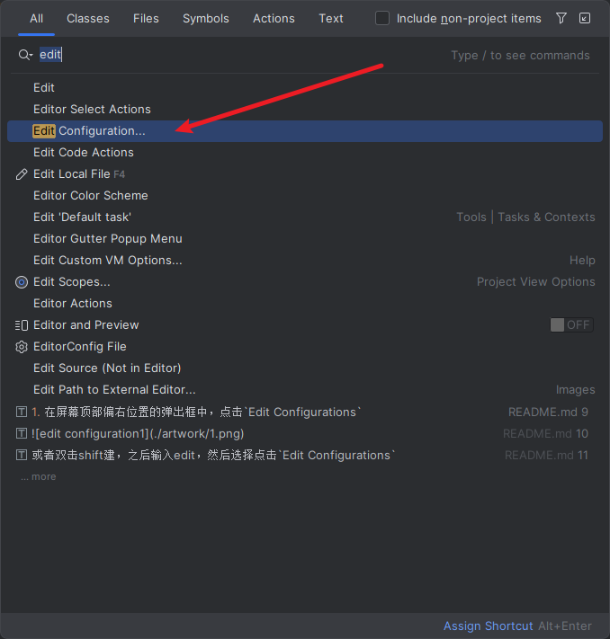
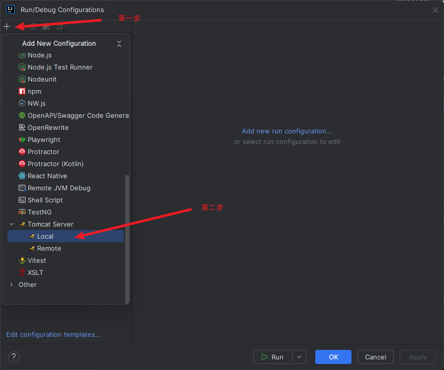
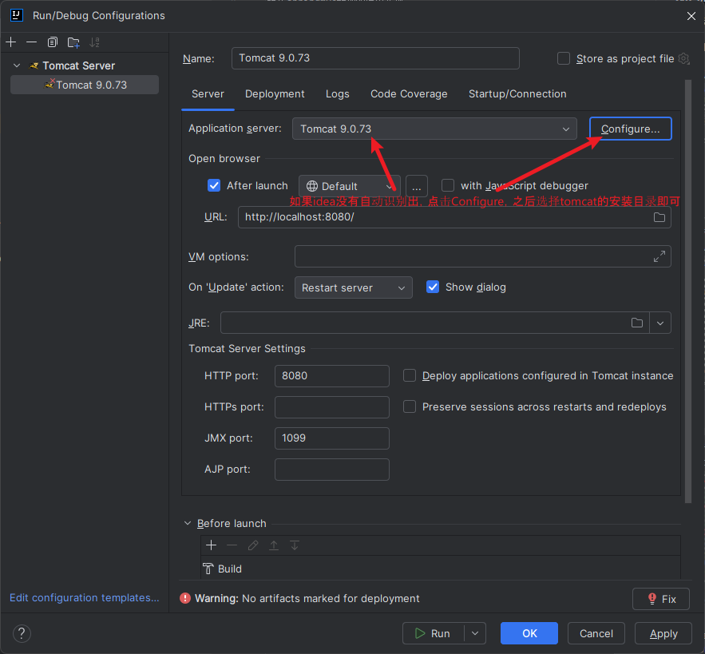
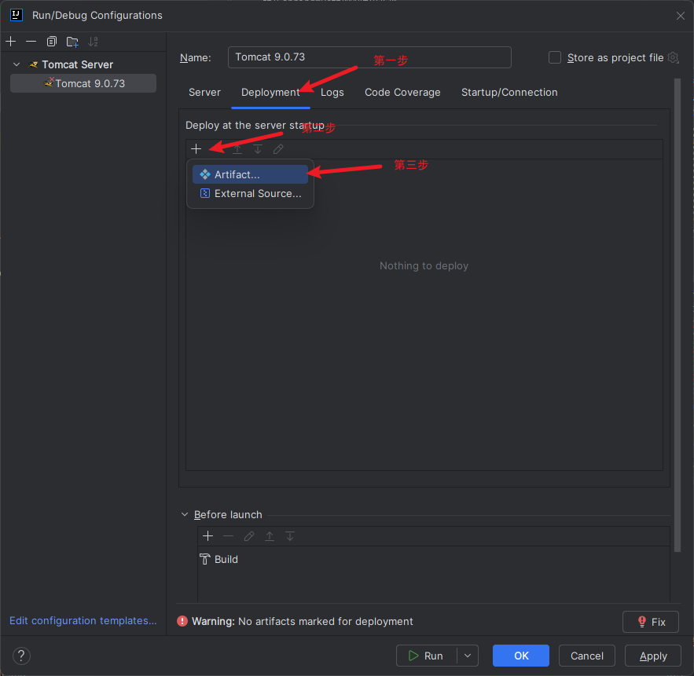
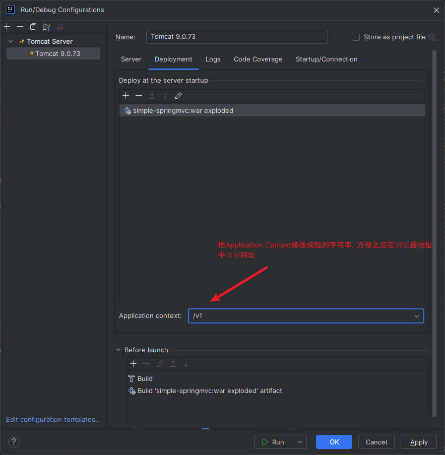
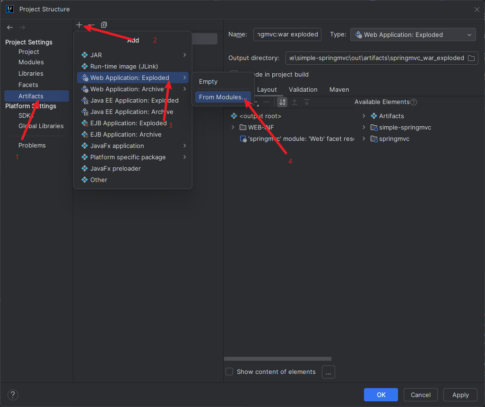

# simple-springmvc

模仿springmvc框架的简单实现

### 应用截图

### 如何启动项目

#### 1. 首先要下载安装[Tomcat服务器](https://tomcat.apache.org/download-10.cgi)

#### 2. 添加Tomcat

1. 在屏幕顶部偏右位置的弹出框中，点击`Edit Configurations`
   
   或者双击`shift`键，之后输入`edit`，然后选择点击`Edit Configuration`
   
2. 点击左上角的“+“号，选择`Tomcat`下的本地`local`
   
   

#### 3. 配置Tomcat

1. 点击`deploy`部署工件，再点击其下方的”+“号，然后选择`artifacts`工件
   
   
2. 记得最后点击“OK”按钮

### 如何添加Artifact工件

在idea顶部工具栏中，依次点击 `File` -> `Project Structure`
